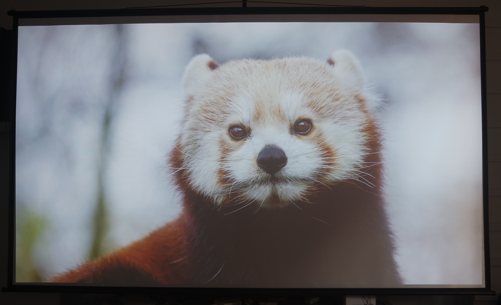
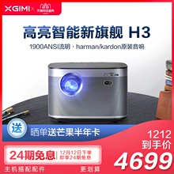
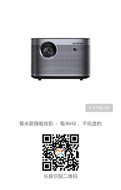

# 极米H3测评——稳健型主力投影

为了买投影，又做了一个月的功课（我怎么那么闲？

这里先回答几个常见问题：

    Q：投影仪是不是寿命短？
    A：过去是的，现在已经是LED灯，标称寿命20000小时，网上普遍表示用个五年十年没问题。

    Q：发热？
    A：是电器都会发热，H3的发热其实不算多。

    Q：风扇噪音？
    A：这个我要好好说说，好的投影仪真没啥噪音，感觉比电脑风扇声音还小。

    Q：亮度不够，白天没有遮光窗帘不行！
    A：亮度没法和电视比，毕竟一个主动发光一个靠反光。但是有几点要说明：
        1. 太亮了对眼睛不好，投影仪我都不开高亮的，我嫌刺眼
        2. 白天看电视效果也会变差
        3. 不需要把屋子全部遮挡，有光完全是OK的，只要是普通窗帘挡了就行

    Q：不清晰！
    A：这也是投影的硬伤之一，但是要注意：投影糊有一部分原因是因为大（投射距离远），就算是60寸电视放大4倍也会糊掉。如果你希望看高清，其实只要把投影拿近一些，也是很清晰的。

    Q：怕踩坑啊！
    A：七天无理由。怕坏的再买个延保。

## 为什么选择智能投影

目前市面上可选的投影其实很多，但是我没有选择传统投影，理由：

1. 传统投影功能单一，需要搭配电视盒子、音箱、网线、电脑才能满足我的需求。
2. 接一大堆线，接口不够用。
3. 家庭用投影仪最佳位置是放在高处，那样场面更加混乱，线也要拉很长。

所以购买智能投影，内置系统，无线访问，下一些视频App，就可以一站式解决以上问题。
市面上智能投影只有那么几家：极米，坚果，天猫，小米。

## 为什么选择极米H3

趁着购物节买了两款作为对比，并且还去过线下店，最终选择极米H3。下面从各个环节评测：

**亮度：** 官方标称流明1900ANSI，咱也不懂咱也不敢问，这里拍夜晚和白天少量阳光直射作为对比：

* 夜晚亮度2
 
* 白天亮度2
 
* 夜晚亮度4
   
* 白天亮度4
   
* 夜晚亮度10
   
* 白天亮度10
   

**实际使用中的感受**：

1. 只要不是强光直射屏幕，不影响观看，白天不用把家里搞成地下室。
2. 利用调高亮度可大大减少外部光源干扰
3. 最高亮度对于我来说着实用不着，从保护视力的角度来说，亮度也不需要那么高。

**清晰度：** 由于是1920x1080的分辨率，是否清晰很大程度上取决于屏幕大小，如果距离幕布近的话，屏幕小了，自然就会清晰很多。（自然不能和激光电视比

**噪音和散热：** 表现令人满意，机器基本不发热（可能是我亮度常年低于5的缘故），缺点是冬天无法暖手。

**投射比：** 距离:宽度=1.2:1，人眼最大舒适视角36度，距离:宽度=1.56:1。投影画面略大于人眼舒适画面，放在人前方，可以投出舒适尺寸，放在人后方就看个人选择，觉得大就变焦。

**音响：** 曼哈顿音箱，低音厚实，整体也比较饱满。家里没有买专业音箱，现在我已经用它作为日常的蓝牙音箱来使用了。

**自动校正：** 支持侧投，自动调焦。实际使用中发现那只是辅助功能，还是需要手动微调。当然，聊胜于无。而且投影一旦选好位置，就不需要这两个功能了。

**动态补偿：** 可以说用了之后就再也离不开了，60帧与30帧完全是两个世界，这里给大家看看区别：

<iframe height=600 width=800 src='http://player.youku.com/embed/XNDQzNjQ3NzE0MA==' frameborder=0 'allowfullscreen'></iframe>

说完硬件，看看软件方面：

**系统：** 操控流畅，除开机时画面无明显延迟，随之带来的问题是，系统杀后台进程比较积极。（所以不要拿他自身的系统办公。另外系统较为封闭，我举个例子，切换输入法的入口都是隐藏起来的。。。

**投屏：** 提供了六种模式，覆盖主流四种系统。夫复何求啊？非要挑刺的话，Miracast有延迟，也经常出现连不上的情况，AirPlay延迟很低但是偶尔卡顿，但我认为这是技术本身和网络环境的原因。投影仪这里优化空间不大。

**软件：** 自带应用商城只能用寒碜来形容，不过App质量相对有保障。尝试安装过一些手机用App和游戏App，发现有一些会崩溃，可能是权限不够的原因？

**操控：** 可以用微信、手机App、PS4手柄、外接键盘、外接鼠标。基本齐活儿。实际使用发现蓝牙偶尔会打架（抢占同一个信道导致延迟极高，用手机控制重新匹配就好了）。官方称只支持两个蓝牙设备（除去遥控只有一个坑了），但是我试过接4个也能用，所以还是看缘分。。。

**游戏：** TV游戏都是些坑货，不如自己装模拟器或者接游戏机，绑定手柄，岂不美哉？有人说投影打游戏有60ms+延迟，实际使用中没有感觉，理论上也不应该有。毕竟投影仪就是亮度很高屏幕很小的显示器，没理由延迟变高。甚至网络给力的话，云游戏延迟也在60ms内。

**电视：** 央视有App，主流视频网站都有App，其他地方台可能要自己去找第三方App才能看了。也可以接机顶盒。

**播放器：** 自带播放器其实还不错，只是遇到mkv就傻了，还是kodi吧。

## 总结

**优点：**

* 梯形校正，支持侧投
* 噪音低，基本听不到
* 系统流畅
* 亮度高，白天可看
* 音响效果不错，平时可作为蓝牙音箱使用
* 线下门店，先看再买
* 客服回复及时，有问必答
* 1920x1080p，画面清晰
* 动态补偿，显示流畅
* 游戏模式，无明显延迟感
* 双HDMI接口，避免频繁插拔。
* 无线投屏支持完整，打通各大平台
* 双USB口，可接外设

**缺点：**

* 系统相对封闭，无法Root
* 权限限制，部分小众App和传统手机App无法运行。
* 蓝牙支持很奇怪，信道冲突可能导致遥控失灵
* USB2.0接口，速度有限
* 自带商店应用太少
* 自动校准无法到最佳清晰度
* 自带播放器不支持mkv，需要下载专业播放器

总评：瑕不掩瑜，买入评级

**直达连接：**

[某宝旗舰店](https://s.click.taobao.com/P8Eoitv)

[极米官网](https://j.youzan.com/5ZMTjY)

**扩展阅读：**
[如何将你的智能投影仪发挥到极致？](http://rainssong.github.io)
