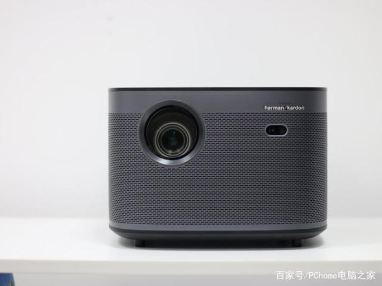

极米H3评测

为了买投影，又做了一个月的功课（我怎么那么闲？

这里先回答几个常见问题：

    Q：投影仪是不是寿命短？
    A：过去是的，现在已经是LED灯，标称寿命20000小时，网上普遍表示用个五年十年没问题。

    Q：发热？
    A：是电器都会发热，这个投影仪的发热其实不算多。

    Q：风扇噪音？
    A：这个我要好好说说，好的投影仪真没啥噪音，感觉比电脑风扇声音还小。

    Q：亮度不够，白天没有遮光窗帘不行！
    A：亮度没法和电视比，毕竟一个主动发光一个靠反光。但是有几点要说明：
        1. 太亮了对眼睛不好，投影仪我都不开高亮的，我嫌刺眼
        2. 白天看电视效果也会变差
        3. 不需要把屋子全部遮挡，有光完全是OK的，只要是普通窗帘挡了就行

    Q：不清晰！
    A：这也是投影的硬伤之一，但是要注意：投影糊有一部分原因是因为大（投射距离远），就算是60寸电视放大4倍也会糊掉。如果你希望看高清，其实只要把投影拿近一些，也是很清晰的。

    Q：怕踩坑啊！
    A：买来试试！七天无理由，怕毛。

目前市面上可选的投影其实很多，有。。。

但是我没有选择传统投影，理由：
1. 传统投影功能单一，需要搭配电视盒子、音箱、网线、电脑才能满足我的需求。
2. 接一大堆线，接口不够用。
3. 投影仪通常需要放在高处，场面更加混乱，线也要拉很长。

所以购买智能投影，内置系统，无线访问，下一些视频App，一站式解决以上问题。
市面上智能投影只有那么几家：极米，坚果，天猫，小米。

趁着购物节买了两款作为对比，最终选择极米H3。

优点：

* 梯形校正，支持侧投
* 噪音低，基本听不到
* 系统流畅
* 亮度高，白天可看
* 音响效果不错，平时可作为蓝牙音箱使用
* 线下门店，先看再买
* 售后到位
* 1920x1080p，画面清晰
* 动态补偿，显示流畅
* 游戏模式，无明显延迟感
* 双HDMI接口，避免频繁插拔。
* 无线投屏支持完整，打通各大平台
* 双USB口，可接外设

缺点：

* 系统相对封闭，无法Root
* 权限限制，部分小众App和传统手机App无法运行。
* 蓝牙支持很奇怪，同时连接太多设备可能导致遥控失灵
* USB2.0接口，速度有限
* 自带商店应用太少
* 自动校准无法到最佳清晰度
* 自带播放器不支持mkv，需要下载专业播放器

总评：瑕不掩瑜，买入评级